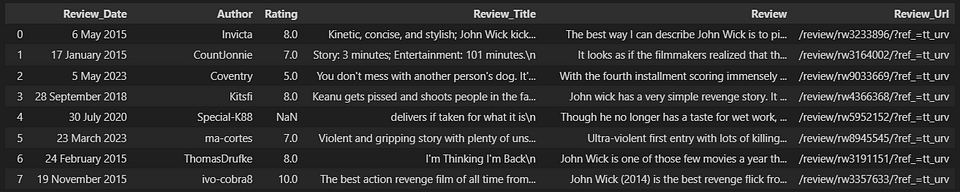

# Advanced Retrieval to improve your Rags

## Introduction

RAGs have countless use cases in industry and business. This technology or method is being used increasingly to create AI assistants that need to have access to an extensive source of data to provide a good service. Therefore, it is key that this technique be optimized and adapted to each use case.

In this repository you will find some of the techniques to improve your RAGs. 

Let's briefly remember what the 3 acronyms that make up the word RAG mean:

**Retrieval**: The main objective of a RAG is to collect the most relevant documents/chunks regarding the query.

**Augmented**: Create a well-structured prompt so that when the call is made to the LLM, it knows perfectly what its purpose is, what the context is and how it should respond.

**Generation**: This is where the LLM comes into play. When the model is given good context (provided by the "Retrieval" step) and has clear instructions (provided by the "Augmented" step), it will generate high-value responses for the user.

## What Will We Cover?

In this repository, we will explore 4 different methods of retrievers.

1. Naive Retreiver
2. Parent Document Retreiver
3. Self Query Retreiver
4. Contextual Compression Retreiver (reranking)

**Important Note**: This repository is focused on showing different methods of retrievers.

## Data

To expose these methods, a practical use case will be carried out to improve the explanation. Therefore, we are going to create a RAG about reviews of the John Wick movies.

There are 4 CSV files and the columns are:

- `Review_Date`
- `Author`
- `Rating`
- `Review_Title`
- `Review`
- `Review_Url`

As is well known, RAGs collect the necessary context from the vector store. To create a vector store of these 4 files there is the jupyter notebook called: **0_create_vectore_db.ipynb**.

## Method 1: Naive Retreiver
You can find it in the **1_naive_retriever.ipynb** file.

## Method 2: Parent Document Retreiver
You can find it in the **2_parent_document_retriever.ipynb** file.

## Method 3: self Query Retriever
You can find it in the **3_self_query_retriever.ipynb** file.

## Method 4: Contextual Compression Retriever (Reranking)
You can find it in the **4_contextual_compression_retriever(reranking).ipynb** file.